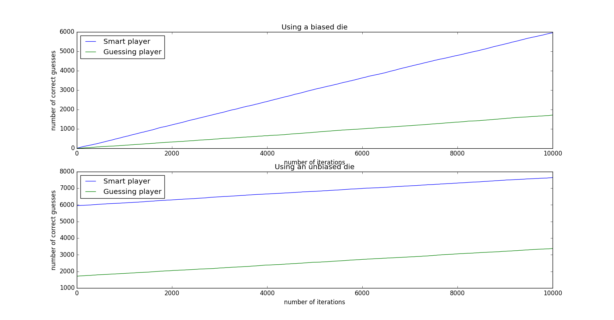

# Gambling

Monte Carlo simulations to gauge which player maximizes winnings at guessing a Die's outcome

## setup

* A biased and unbiased die are created based on the probabilities of any sides showing face up.
* Two players are created; one guessing the die value randomly and another using passed experience  of most occuring side to guess
* A simulation is run n times to see overall correct guesses after n iterations

Surprising results here. Code still under development  

Run simulation with `python run.py` from root 

